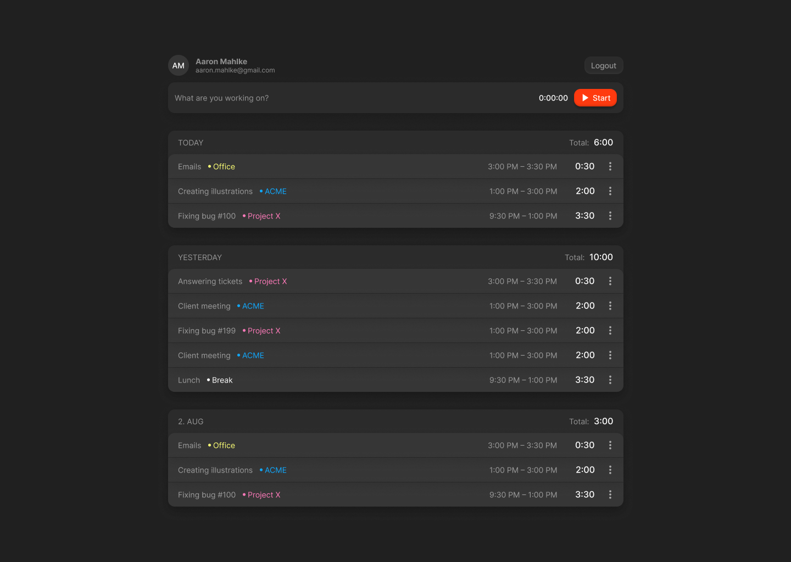

# Momentso

Welcome to the GitHub repo for Momentso! We're your concise, open-source time tracking alternative to Clockify and Toggl. Momentso, designed by humans on Earth for optimal productivity and efficient time management. Explore, contribute, and optimize your workflow with us.

## Tech Stack

**Frontend:** Vue 3, urql, Tailwind CSS

**Backend:** Go, gqlgen, sqlc, Postgres

## Development

### Backend

For backend development, please utilize a local Go 1.21 development environment. Utilize the file `internal/cmd/cmd.go` as the starting point. Remember to duplicate the `.env` file, amend it according to your needs and load it from `.env.template`. Execute the following command to initialize the database:

    docker compose up -d db mailhog

### Frontend Development

When solely focusing on frontend development, utilize a Docker-enabled version of the backend. In the backend directory, execute these commands:

* `docker compose up --build -d` to initialize the database & the backend.
* `docker compose down` for halting the database and backend services.  
* `docker compose run --build --rm backend /app/app migrate:resetAndSeed`, to reset the database, initiating all data migrations and seeding.

## License

[MIT](https://choosealicense.com/licenses/mit/)
